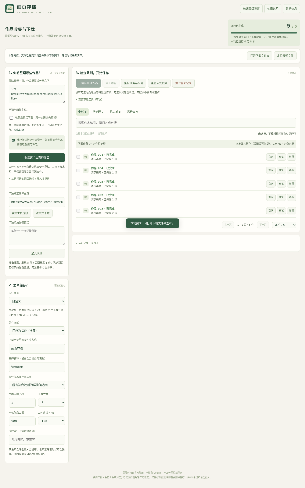
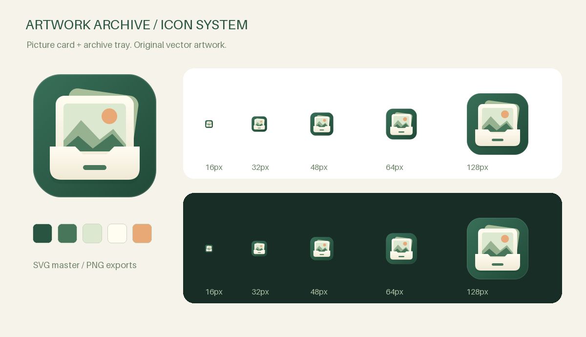

<div align="center">
  
  <h1>画页存档 · Artwork Archive</h1>
  <p>收好作品，也留下来源。</p>
  <p>本地优先 · Chrome / Edge · 无运行时依赖 · Manifest V3</p>
</div>

将获授权的米画师作品及来源整理到自己的电脑。粘贴主页或作品分享链接，收集、预览，再保存为 ZIP 或单张图片。

> **当前版本：0.6.0。** 这是仍在完善的开源工具，不是米画师官方产品，也不保证获得原稿、收集全站作品或避免账号限制。公开可见不等于允许训练等使用；请先确认平台允许的获取方式与权利人授权。

**0.6.0：持久图片暂存与增量状态库。** 已验证图片可在关闭工作台后恢复；下载提交日志避免异常后自动重复保存，图片校验移到串行 Worker，加入休眠停机保护和 5000 条队列回归。查看 [本轮审查](docs/audit-0.6.0.md) 和 [验证记录](docs/verification.md)。



*截图是实际运行界面，使用原创模拟图像和虚构画师数据，不是实站兼容性证明。*

## 安装与部署

> **无需编译**：本项目扩展为纯原生前端实现，**普通用户无需安装 Python / Node.js**，也无需执行任何构建命令。

### 方式一：从源码加载（推荐开发者 / 快速体验）

1. **克隆或下载本仓库源码**：
   ```bash
   git clone https://github.com/Tera-Dark/artwork-archive.git
   ```
2. **打开浏览器扩展管理页面**：
   - **Chrome 用户**：在地址栏输入 `chrome://extensions` 并回车。
   - **Edge 用户**：在地址栏输入 `edge://extensions` 并回车。
3. **开启右上角的「开发者模式」**开关。
4. **点击左上角「加载已解压的扩展程序」**。
5. **选择扩展目录**：
   > ⚠️ **关键注意**：在弹出的文件管理器中，必须进入并选择仓库内的 **`extension/`** 子目录（该目录直接包含 `manifest.json`）。  
   > **请切勿选择项目根目录**，否则浏览器会提示 `清单文件缺失或不可读取。无法加载清单`。
6. **固定图标**：点击浏览器右上角的“拼图”图标（扩展程序），找到 **画页存档 · 作品批量整理** 并点击图钉 📌 固定到工具栏。

---

### 方式二：使用 Release 离线安装包（免 Git）

1. 前往 GitHub Releases 页面，下载最新的 `ArtworkArchive-x.x.x.zip`。
2. 将压缩包解压到一个固定的本地文件夹（解压后即包含 `manifest.json` 等完整扩展文件）。
3. 按照上述步骤 2~4，在浏览器扩展管理中点击「加载已解压的扩展程序」，选择刚刚解压的文件夹即可。

---

## 快速上手使用

1. **页面快捷浮动面板**：
   - 浏览器打开任意米画师画师主页或作品详情页。
   - 页面右下角会自动展示「画页存档」轻量浮动面板，点击即可快速提取并加入任务队列。
2. **独立工作台管理**：
   - 点击浏览器工具栏的「画页存档」图标，即可打开全功能独立工作台。
   - 支持直接粘贴画师主页链接、作品详情页直链或带有链接的分享文本。
3. **预览与筛选**：
   - 在任务队列中查看提取结果，支持原图尺寸/分辨率预览，可自定义选择多图模式或单图模式。
4. **批量保存导出**：
   - 点击保存，可选择 **ZIP 打包保存**（自动包含 SHA-256 去重与来源清单文档）或 **单张图片保存**。
   - 下载完成后点击「打开下载文件夹」即可查看归档产物。

---

## 常见问题 (FAQ)

- **Q: 加载扩展时报错“清单文件缺失或不可读取。无法加载清单”？**  
  **A**: 绝大多数是因为在文件选择器中误选了项目的根目录。请重新点击「加载已解压的扩展程序」，双击进入 `artwork-archive/` 里面的 **`extension`** 文件夹，然后点击“选择文件夹”。
- **Q: 为什么部分画师的作品无法获取或提示登录？**  
  **A**: 部分画师主页或作品设有仅限注册用户查看的访问限制。本扩展遵循隐私安全原则，**不盗取、不存储用户的任何 Cookie 与登录密码**。遇到受限页面，请先在当前浏览器中正常登录米画师官网，然后再进行收集即可。
- **Q: 关闭工作台之后，之前下载的任务会丢失吗？**  
  **A**: 0.6.0+ 版本支持持久图片暂存与本地增量状态库。意外关闭工作台后重新打开，未导出的暂存图片依然可以恢复并直接导出为 ZIP。

---

## 主要功能

- **不用判断链接类型**：识别主页、作品链接和常见分享文字；支持多条作品链接去重加入。
- **后台主页收集**：先滚动批量提取页面链接，再解析必要的无链接卡片；独立任务页工作，保留原页浏览位置。
- **轻量浮动面板**：可拖动、收起、记住位置、显示进度和停止；无须先跳到工作台配置。
- **只要直链也可以**：后台批量解析详情图地址，不提交图片文件下载；导出已解析直链 TXT。链接可能过期或限制外部下载。
- **先预览再保存**：显示候选图片和尺寸，可选择多图或最大图模式。
- **ZIP / 单张保存**：ZIP 模式提供 SHA-256 内容去重、分卷和来源清单；原生模式按图片 URL 去重。
- **省心预设**：推荐、慢速轻量、较快三档；高级参数默认收起。
- **好管理的队列**：搜索、状态筛选、分页、勾选下载、逐项重置与移除。
- **中断可处理**：成功记录和已提交的图片暂存保留，重开后可离线保存 ZIP；失败不自动重试。
- **可迁移记录**：支持导入旧版工作台 JSON 和完整任务备份。
- **少一点技术报错**：明确提示下一步怎么做；可打开任务网页和定位最近文件。
- **隐私友好的反馈**：诊断导出只保留必要环境、计数和错误类别，不带作品 URL、备注或完整日志。

普通用户流程及常见问题：[使用指南](docs/user-guide.md)。行为细节：[技术边界](docs/advanced.md)。

## 图标与设计

“画作 + 档案盒”的原创图标，保留 SVG 源文件，并提供 16–1024 px 的 PNG 输出。图标与程序代码采用本仓库 MIT 许可，不包含第三方画师作品授权。



设计源文件与重绘方法：[design/](design/README.md)。

## 数据与边界

- 任务、图片和备注留在本机。没有开发者上传服务器、遥测、广告或远程扩展代码。
- 会向官网和页面提供的图片地址发起正常请求；本地优先不等于没有网络访问。
- 不读取 Cookie、不接收密码、不绕过登录验证、不轮换代理或账号、不去水印。
- `403 / 429`、登录验证或不支持的页面会停止；自动停止检测不是对所有风控的覆盖保证。
- 仅保存页面实际提供的详情展示图，不推测原稿地址。特殊图集、虚拟列表和改版页面可能不支持。
- 关闭工作台停止任务，不删除已提交的图片暂存；长时间节流后保守停止，需人工继续。清除扩展数据或卸载会删除暂存。浏览器下载和网站自身请求不受工具完全控制。

阅读 [隐私说明](docs/privacy.md)、[安全说明](SECURITY.md) 和 [验证范围](docs/verification.md)。

## 我想开发或提交 PR

运行环境与开发环境分开：扩展本身不依赖 Node / Python；下面的工具仅用于验证、生成文档、绘图和打包。

```bash
# Node.js 20+；安装的唯一 Node 开发依赖是代码格式工具
npm ci
npm run check
npm test
npm run format:check

# Python 3.10+，打包仅用标准库
python tools/package.py
```

输出位于 `artifacts/ArtworkArchive-0.6.0.zip`，清单在 ZIP 根目录，同时生成 SHA-256 校验文件。打包结果是确定性的，同样的源码产生相同字节的 ZIP。

浏览器回归测试使用本地 HTTPS 模拟站点，不登录真实账号：

```bash
# 推荐 Linux / WSL / CI；需要 OpenSSL
python -m pip install -r requirements-dev.txt
python -m playwright install --with-deps chromium
python tests/e2e/run.py
```

完整说明：[开发指南](docs/development.md)。图标生成是单独的可选流程，不影响使用或常规打包。

## 仓库结构

```text
artwork-archive/
├── extension/          # 可直接加载的扩展源码
├── design/             # SVG 图标源文件和额外尺寸导出
├── docs/               # 用户指南、架构、隐私与验证说明
├── tests/
│   ├── unit/           # 纯 UI 规则、诊断白名单与 ZIP 单元测试
│   ├── packaging/      # 发行包结构与确定性测试
│   └── e2e/            # 本地模拟站点的浏览器回归测试
├── tools/              # 检查、打包、文档与图标生成工具
├── .github/            # CI、Issue 和 PR 模板
└── artifacts/          # 本机生成结果；已被 Git 忽略
```

历史安装包、真实画师样本、下载记录、旧实验日志、浏览器配置和发布账号资料不属于源码仓库。不要把整个工作区当成这个仓库上传。

## 验证状态

已提供可重复运行的静态检查、单元测试和浏览器回归测试；浏览器测试使用模拟网页、原创图像和全新浏览器配置。具体本次执行结果见 [验证记录](docs/verification.md)。

**没有声称已在所有 Windows / Edge 版本或所有米画师实站页面中通过测试。** 真实网站此前在测试环境返回过 403，工具停止了访问。网页结构适配仍需持有许可的使用者在自己的浏览器中验收。

准备首次提交或导出源码 ZIP：[GitHub 仓库准备指南](docs/repository.md)。

## 反馈与贡献

先查看 [使用指南](docs/user-guide.md)。反馈问题请优先附上工作台生成的诊断 JSON，避免上传 Cookie、私人图片、完整任务备份或带敏感信息的截图。

- [贡献指南](CONTRIBUTING.md)
- [安全问题处理](SECURITY.md)
- [版本记录](CHANGELOG.md)
- [维护路线](docs/roadmap.md)

## 许可

程序及原创设计资源使用 [MIT License](LICENSE)。该许可不适用于下载的作品、站点内容或第三方素材，也不赋予训练、转载或商业使用这些内容的权利。
