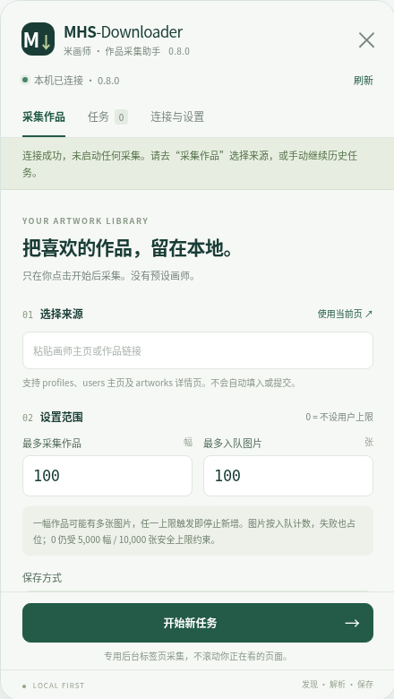

# MHS-Downloader

<div align="center">

**米画师（mihuashi.com）页内沉浸式浮动面板 + Windows 本机高能下载与归档引擎**

[](LICENSE)
[](https://www.python.org/)
[](https://developer.chrome.com/docs/extensions/mv3/intro/)
[]()
[](CHANGELOG.md)

[快速开始](#-快速开始三步上手) • [核心特性](#-核心特性) • [日常使用指南](#-日常使用指南) • [配置与节奏控制](#-配置与节奏控制) • [常见问题](#-常见问题-faq)

</div>

---

## 📖 项目简介

**MHS-Downloader** 是一款专为米画师设计的高效作品批量采集、下载与画集归档工具。项目采用 **“Chrome 轻量页内扩展 + Windows 本机持久化引擎”** 的双核解耦架构：
- **前端交互**：直接在米画师官网右下角嵌入沉浸式 **MHS 浮动面板**，无需在额外网页间来回切换，支持 `Alt+M` 一键唤出。
- **本机引擎**：基于 Python + SQLite 构建本地下载队列，支持 **画师专属文件夹自动分类**、**HTTP Range 断点续传**、**SHA-256 内容哈希去重** 以及 **一键打包导出 ZIP 快照**。

<div align="center">
  
</div>

---

## 🚀 快速开始（三步上手）

### 第一步：启动本机程序
1. 将本项目解压/克隆到本地固定目录（例如 `D:\MHS-Downloader`）。
2. 双击运行根目录下的 **`START-WINDOWS.bat`**。
   - *首次运行会自动检测 Python（支持 3.11+）并自动创建虚拟环境 `.venv`、安装轻量依赖。*
   - 控制台看到类似 `[MHS-Downloader 配对令牌] xxxxxxxxxxxx` 说明本机服务已成功就绪，**请保持该控制台窗口运行**。

### 第二步：安装 Chrome 扩展
1. 在 Chrome / Edge 浏览器地址栏访问：`chrome://extensions/`。
2. 开启右上角的 **“开发者模式”** 开关。
3. 点击 **“加载已解压的扩展程序”**，选择本项目内的 **`extension`** 文件夹（不是项目根目录）。

### 第三步：配对并开始采集
1. 打开或刷新 [米画师官网](https://www.mihuashi.com/)，在页面右下角能看到绿色的 **MHS** 悬浮按钮（快捷键 `Alt+M`）。
2. 点击展开面板，切换到 **连接与设置** 标签页，将第一步控制台中生成的 **配对令牌** 粘贴进去，点击 **连接本机**。
3. 浏览任意画师主页（如 `/profiles/194372` 或 `/users/...`）或作品详情页，在面板点击 **使用当前页**，设定需要的数量上限，点击 **开始新任务** 即可！

---

## ✨ 核心特性

- 📁 **按画师自动分目录归档**
  - 自动智能解析画师真实昵称（如“藤原可可”）；
  - 下载图片自动保存在专属文件夹：`data/images/{画师名字}/{图片哈希}.jpg`，画集井井有条，避免成千上万张图片混杂在一起；
  - 严格执行 Windows 文件名安全清洗，自动过滤非法字符并提供健壮的回退标识机制。
- 🎯 **沉浸式页内浮动面板 (MHS Panel)**
  - 取消繁琐的独立后台页面，直接在米画师网站右下角悬浮展开；
  - 支持快捷键 `Alt+M` 呼出/隐藏，`Esc` 快速收起，不破坏正常浏览体验。
- 🛡️ **安全的显式启动与配对设计**
  - 连接与启动完全解耦：配对令牌仅负责安全鉴权，连接成功绝对不会偷偷自动开始下载，所有采集任务完全由您主动发起；
  - 本地 API 仅监听 `127.0.0.1:47653` 回环地址，严密校验来源身份。
- 🔄 **智能瀑布流与虚拟列表防漏扫描**
  - 专为米画师复杂前端组件优化，优先读取已挂载组件的作品 ID，避免逐卡模拟点击；
  - 自动处理嵌套滚动容器、无限滚动虚拟列表与懒加载状态，配有静默看门狗与自适应指数退避自动补扫。
- ⚡ **稳健的断点续传与持久化引擎**
  - 基于 SQLite WAL 模式构建可靠的任务队列，网络波动或中断随时可恢复；
  - 严格校验 `HTTP Range`，支持断点续传，不下载损坏分片；
  - 基于内容 SHA-256 哈希命名和去重，同一作品即使多次扫描也绝不重复下载；
  - 支持将已完成图片一键导出为带分类与 `manifest.json` 元数据的 ZIP 归档包。

---

## 📋 日常使用指南

### 1. 采集画师全部作品
- 打开目标画师个人主页（例如 `https://www.mihuashi.com/profiles/194372`）；
- 按 `Alt+M` 打开面板，点击 **使用当前页**；
- 设定作品上限和图片上限（默认为 100 幅 / 100 张，若设为 `0` 则表示不限，受 5000/10000 的安全保护限制）；
- 点击 **开始新任务**，可在“任务”标签页实时观察扫描与下载双重进度。

### 2. 仅采集图片直链
- 在创建任务时，将模式选择为 **“仅收集图片直链”**；
- 解析完成后直接在面板中点击 **导出链接**，生成 TXT 清单。

### 3. 查看和管理文件
- 在面板底部点击 **打开图片目录**，可一键在 Windows 资源管理器中打开 `data/images`（按画师分文件夹）；
- 点击 **导出已完成图片 ZIP**，快照包将生成在 `data/exports` 中。

---

## ⚙️ 配置与节奏控制

可在面板或任务详情中动态调整采集节奏，兼顾效率与安全：

| 参数项 | 默认值 | 调节范围 | 功能说明 |
|:---|:---:|:---:|:---|
| **最多作品** | 100 幅 | 0–5,000 | 限制入队的最大作品数量（0 为不限） |
| **最多图片** | 100 张 | 0–10,000 | 限制入队的最大图片数量（0 为不限） |
| **下载并发** | 3 | 1–4 路 | 图片下载并发线程数，默认 3 路高效均衡 |
| **页面间隔** | 1.5 秒 | 1.0–10.0 秒 | 页面浏览与翻页延迟，保护网站连接健康 |
| **自动补扫** | 3 次 | 0–5 次 | 遇到未完全加载列表时的重试补全轮数 |
| **文件重试** | 3 次 | 0–5 次 | 单张图片网络抖动时的重试次数（支持指数退避） |

> **节奏预设快捷切换**：面板提供了 **稳妥**（1 并发 / 3 秒间隔）、**均衡**（3 并发 / 1.5 秒间隔）、**较快**（4 并发 / 1 秒间隔）一键切换。

---

## ❓ 常见问题 (FAQ)

<details>
<summary><b>Q1: 启动 START-WINDOWS.bat 提示找不到 Python？</b></summary>

启动脚本会自动查找 PATH 中的 Python 以及系统常用安装目录。如果您安装在自定义路径，可以在启动前指定环境变量：
```bat
set "MHS_PYTHON=D:\YourPythonPath\python.exe"
START-WINDOWS.bat
```
</details>

<details>
<summary><b>Q2: 面板提示“本机程序未连接”或“47653 端口被占用”？</b></summary>

1. 检查黑色的 `START-WINDOWS.bat` 控制台窗口是否处于运行状态；
2. 确认没有多开其他占用 `47653` 端口的程序；
3. 如果更新了版本，请先关闭所有旧窗口后重新启动。
</details>

<details>
<summary><b>Q3: 下载的图片保存在哪里？</b></summary>

默认保存在项目根目录下的 `data/images` 中。本版本已开启**画师专属子目录**功能，每个画师的作品会自动存放在以该画师命名的文件夹内（例如 `data/images/藤原可可/`）。
</details>

<details>
<summary><b>Q4: 网页遇到登录拦截或滑块验证？</b></summary>

程序遇到 401/403/429 或人机验证弹窗时，会主动进入保护性暂停（Hold 状态），避免触发更严格的风控。您只需在浏览器正常完成验证或登录后，在面板中点击“官网已恢复，解除拦截”，即可继续下载。
</details>

---

## 📄 许可证与合规声明

- 本项目采用 [MIT License](LICENSE) 开源许可。
- **免责声明**：本项目仅供个人学习、技术研究以及在遵守著作权法规与平台规则的前提下对自己拥有合法使用权的作品进行本地整理备份使用。请勿用于未授权商业用途或高频破坏性抓取。

<div align="center">
Made with ❤️ for digital art lovers.
</div>
